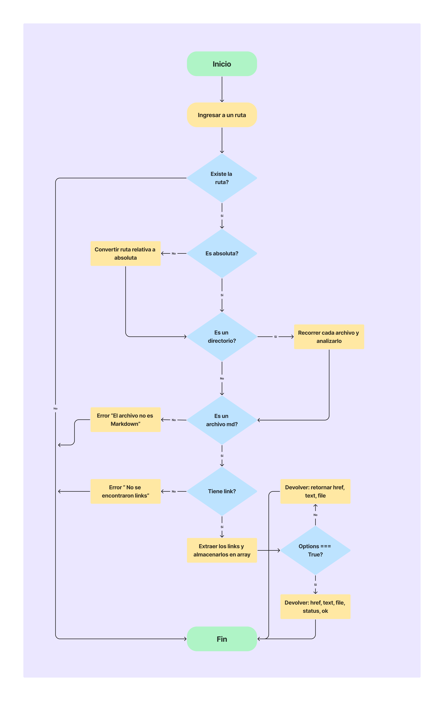
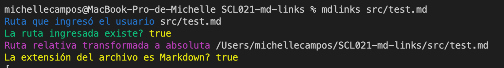
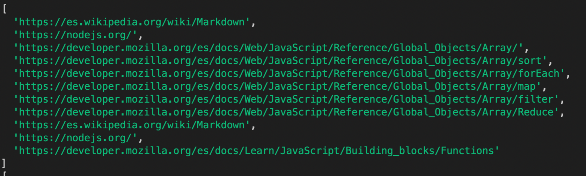
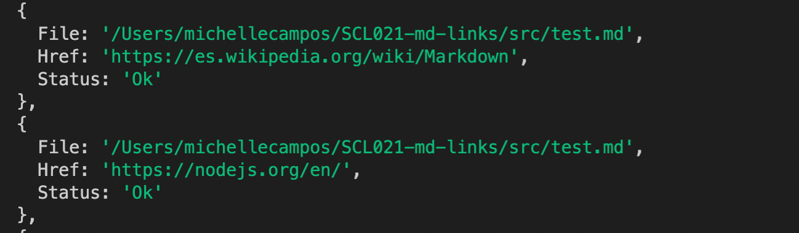
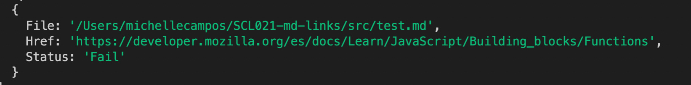

# Markdown Links👩🏻‍💻

Este proyecto es una librería creada en NodeJs que permitirá leer archivos Markdown que se encuentren dentro de un directorio o en un archivo. Podrás extraer los links de estos y validar el estatus de cada uno. Como resultado nos puede entregar distintas estadísticas según el comando que se ingrese.

## Preámbulo

[Markdown](https://es.wikipedia.org/wiki/Markdown) es un lenguaje de marcado ligero muy popular entre developers. Es usado en muchísimas plataformas quemanejan texto plano (GitHub, foros, blogs, ...) y es muy común encontrar varios archivos en ese formato en cualquier tipo de repositorio (empezando por el tradicional `README.md`).

Estos archivos `Markdown` normalmente contienen _links_ (vínculos/ligas) que muchas veces están rotos o ya no son válidos y eso perjudica mucho el valor de la información que se quiere compartir.

Dentro de una comunidad de código abierto, nos han propuesto crear una herramienta usando [Node.js](https://nodejs.org/), que lea y analice archivos en formato `Markdown`, para verificar los links que contengan y reportar algunas estadísticas.

## Diagrama de flujo
A continuación se muestra el diagrama de flujo creado para desarrollar dicha librería:

## Información mostrada al usar la librería

- El usuario deberá ingresar la ruta a leer, si no es válida se mostrará un mensaje de error. Si la ruta proporcionada es absoluta continuará la lectura de los links, de no ser así se transformará la ruta relativa a absoluta.

- Luego se confirmará si existen archivos Markdown en la ruta entregada para ser leídos posteriormente.

### Lectura de cada link que se encuentre en el archivo Markdown

- Buscará cada link que se encuentre en el archivo Markdown y proporcionará una lista de estos.

### Valida cada link encontrado para mostrar datos específicos.

- En caso de que el link no esté roto mostrará un estado de "Ok"

- En caso de que el link esté roto mostrará un estado de "Fail"

